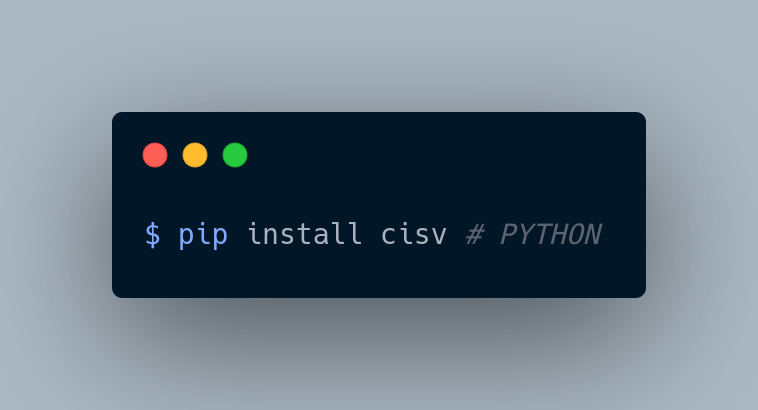
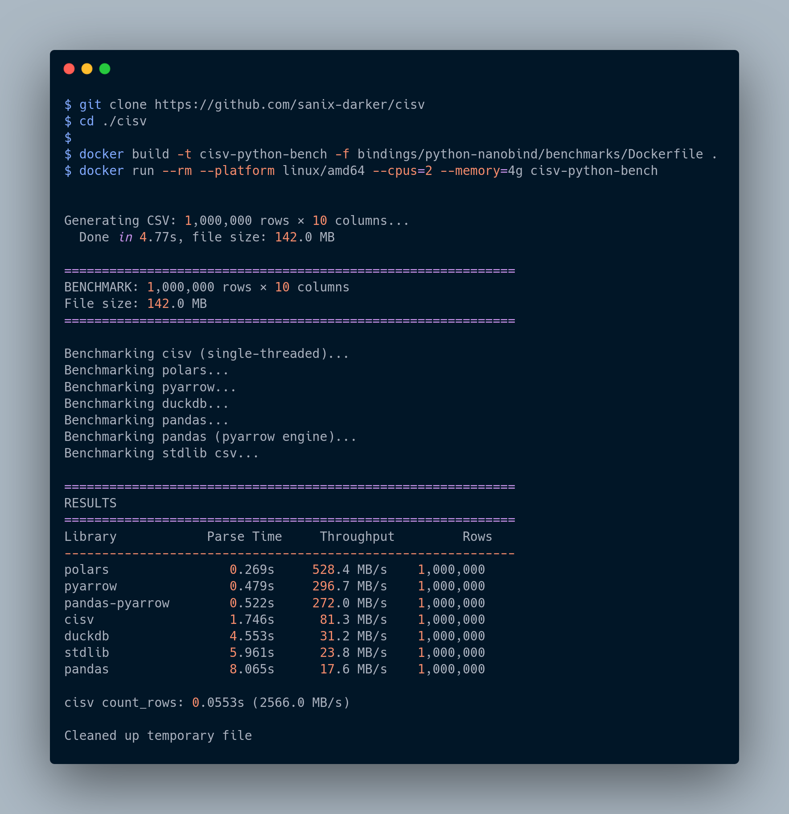

# cisv-python



[](https://github.com/Sanix-Darker/cisv-python/actions/workflows/ci.yml)

[](https://pypi.org/project/cisv/)


Python binding distribution for CISV using the nanobind implementation (`cisv`) with SIMD-accelerated core parsing.

## FEATURES

- Native C-backed parser exposed to Python
- `parse_file`, `parse_string`, and `count_rows` APIs
- Iterator API (`CisvIterator` / `open_iterator`) for memory-efficient streaming
- Parallel parse mode for large files
- Early-exit iteration support for pipeline-style processing

## SUPPORTED PYTHON VERSIONS

- Minimum supported version: Python 3.10
- Tested in CI on Python 3.10 and 3.12

## INSTALLATION

### FROM PYPI

```bash
pip install cisv
```

### FROM SOURCE

```bash
git clone --recurse-submodules https://github.com/Sanix-Darker/cisv-python
cd cisv-python
make -C core/core all
cd cisv
pip install .
```

## CORE DEPENDENCY (SUBMODULE)

This repository tracks `cisv-core` via the `./core` git submodule.

To fetch the latest `cisv-core` (main branch) in your local clone:

```bash
git submodule update --init --remote --recursive
```

CI and release workflows also run this update command, so new `cisv-core` releases are pulled automatically during builds.

## QUICK START

```python
import cisv

rows = cisv.parse_file("data.csv", delimiter=",", trim=True)
print(rows[0])
```

## API EXAMPLES

### PARSE A FILE WITH OPTIONS

```python
import cisv

rows = cisv.parse_file(
    "data.csv",
    delimiter=",",
    quote='"',
    trim=True,
    skip_empty_lines=True,
)
```

### PARSE IN PARALLEL

```python
import cisv

rows = cisv.parse_file("large.csv", parallel=True)
```

### ROW COUNTING WITHOUT FULL PARSE

```python
import cisv

count = cisv.count_rows("large.csv")
print(count)
```

### ITERATOR MODE FOR HUGE FILES

```python
import cisv

with cisv.CisvIterator("very_large.csv", trim=True) as it:
    for row in it:
        if row and row[0] == "STOP":
            break
        # process row
```

### CONVENIENCE ITERATOR HELPER

```python
import cisv

for row in cisv.open_iterator("data.csv", delimiter=",", trim=True):
    print(row)
```

## EXAMPLES DIRECTORY

Runnable examples are available in [`examples/`](./examples):

- `basic.py`
- `iterator.py`
- `sample.csv`

## BENCHMARKS

```bash
docker build -t cisv-pynb-bench -f cisv/benchmarks/Dockerfile .
docker run --rm --platform linux/amd64 --cpus=2 --memory=4g cisv-pynb-bench
```



The benchmark output includes both full parse and iterator paths (including `cisv-iterator`).

## UPSTREAM CORE

- cisv-core: https://github.com/Sanix-Darker/cisv-core
